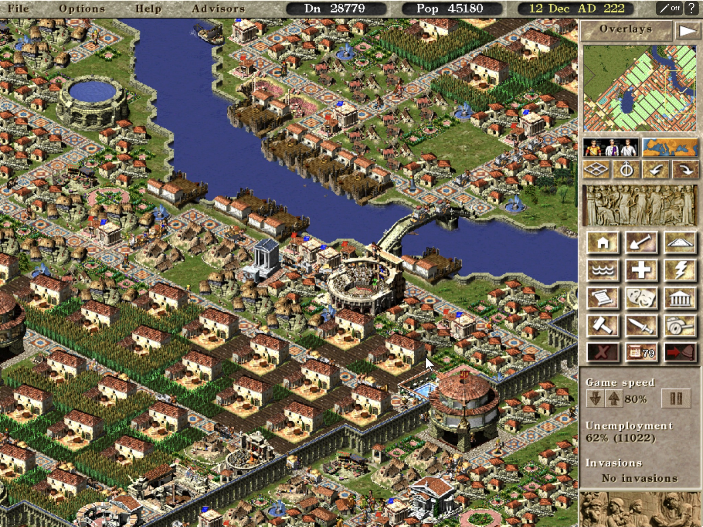
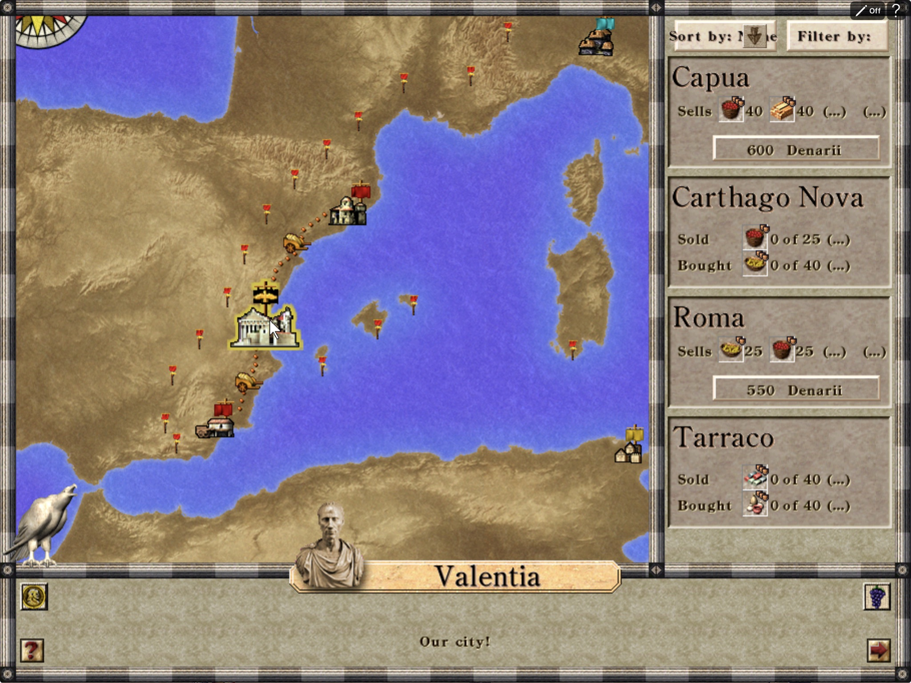
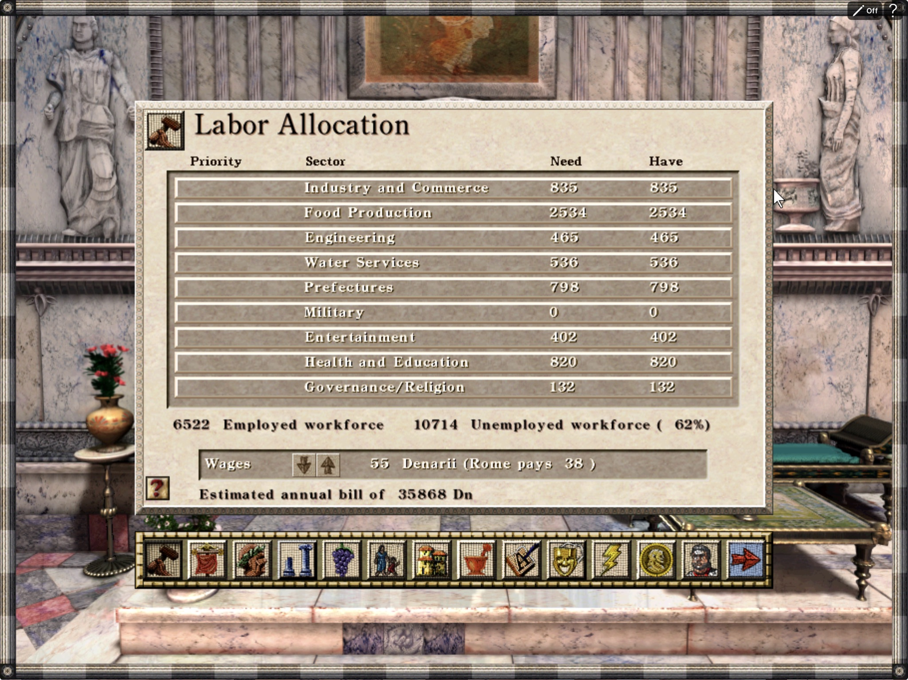
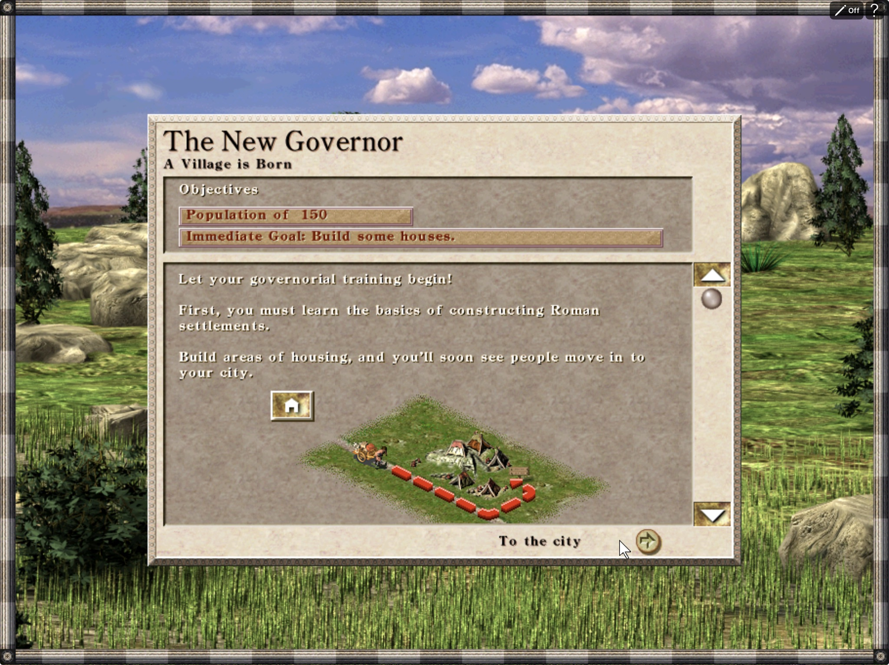

<p align="center">
  
</p>

<h1 align="center">CaesarPad</h1>

<p align="center">
  <strong>Caesar III on an iPad-shaped canvas, powered by Augustus.</strong><br>
  0.1.0 preview candidate · Augustus only · Simulator and local iPad verified
</p>

<p align="center">
  <a href="https://github.com/chrissotraidis/caesarpad/actions/workflows/ios-build.yml"></a>
  
  
  
  
</p>



CaesarPad packages the open-source [Augustus](https://github.com/Keriew/augustus) engine
as a landscape iPadOS app. It adds direct touch and Apple Pencil input, readable interface
scaling, visible cursor feedback, map gestures, lifecycle recovery, and repeatable build and
Simulator automation.

This repository contains the mobile integration and build scripts. It does **not** contain
Caesar III or any of its game data; you supply your own legally purchased files locally.

> [!IMPORTANT]
> CaesarPad is currently a **developer-preview release candidate**. The repository builds
> and audits an unsigned, re-signable IPA, but no GitHub Release, TestFlight build, App Store
> listing, or AltStore source has been published yet.

[What works](#what-works-today) · [Controls](#touch-controls) · [Screenshots](#current-screenshots) ·
[Install IPA](docs/INSTALL_IPA.md) · [Run it](#run-in-ipad-simulator) · [How it works](#how-it-works) ·
[Project status](STATE.md)

## Install status

| Option | Status | What to do |
|---|---|---|
| iPad Simulator | **Verified** | Supply your own Caesar III data and use the automated setup below. |
| Local iPad build | **Verified for development** | Build and sign locally with your Apple development team; no end-user package is published. |
| Unsigned `.ipa` | **Release candidate built locally** | Follow the [installation guide](docs/INSTALL_IPA.md) after the matching GitHub prerelease is published. |
| App Store / TestFlight | **Not announced** | No listing or public TestFlight currently exists. |

## What works today

- Augustus builds and runs in landscape on an iPad Simulator.
- Direct touches leave a visible 140% cursor at the last touched position.
- iPad builds use a minimum 150% display scale for larger text and controls.
- A mission can be started, panned, zoomed, paused, and played without a keyboard.
- Local, legally purchased Caesar III data can be injected into the Simulator container.
- The app's Documents directory is Files-visible for sideloaded game-data setup and save backup.
- Backgrounding creates a recovery save; a cold launch resumes and consumes it.
- Engine touch tests and identifier-based iPad UI checks pass on the current toolchain;
  recorded end-to-end Simulator evidence covers gameplay and lifecycle.
- The device build can be packaged as an unsigned IPA with signing and game-data audits.
- The complete clean-build path passed twice consecutively on the recorded iPad runtime.

Simulator automation proves event routing and visible game behavior, while a local
developer-signed build proves physical-iPad install and launch. Touch comfort, multitouch
feel, audio routes, performance, thermals, Pencil, and trackpad behavior still need
hands-on acceptance.

## Touch controls

| Gesture | Action |
|---|---|
| Tap | Move the visible cursor, then select, place, or press an engine UI control |
| One-finger drag | Pan the city map |
| Two-finger drag | Pan the city map; parallel movement is locked away from zoom |
| Long press | Right-click: cancel the active tool or open information |
| Pinch | Zoom through Augustus's native touch zoom |
| Two-finger tap | Alternate right-click |
| Game speed **pause/play** | Pause or resume from Caesar III's bottom-right panel |
| Top-bar **?** button | Show the control guide and Caesar III interaction model |
| Top-bar **Pencil Off / On** control | Toggle persistent Pencil mode: Pencil selects and places; fingers only pan or pinch |

Traditional touch remains the default. Pencil mode distinguishes Apple Pencil at the UIKit
input boundary, prevents finger taps from changing the city, and keeps one-finger map panning
and pinch zoom available. Caesar III is a city builder rather than an RTS: walkers are
autonomous and cannot be group-selected, while military legions are ordered individually.

## Current screenshots

<table>
  <tr>
    <td width="50%">
      
    </td>
    <td width="50%">
      
    </td>
  </tr>
  <tr>
    <td align="center"><strong>Manage the empire</strong><br>Review cities, trade routes, and regional activity.</td>
    <td align="center"><strong>Run the city</strong><br>Open the full Caesar III advisor interface with touch or Pencil.</td>
  </tr>
</table>

<p align="center">
  
</p>

<p align="center">
  <strong>Begin a campaign</strong><br>
  Play the original campaign and learn the city-building systems directly on iPad.
</p>

The hero and gallery captures show the current CaesarPad build running with locally supplied
Caesar III data. The game files and developed save used for these screenshots are not included
in this repository.

## Run in iPad Simulator

You need macOS, Xcode, and your own legally purchased Caesar III files. Then:

```sh
git clone --recurse-submodules https://github.com/chrissotraidis/caesarpad.git
cd caesarpad
C3_SOURCE_DIR="/absolute/path/to/C3" scripts/install.sh
```

`scripts/install.sh` checks the required tools and game-data markers, selects a booted
iPad Simulator (or the first available iPad), builds CaesarPad, installs it, injects the
local data, and launches the app. Set `SIMULATOR_UDID` only when you want a specific
Simulator. On the first launch, confirm Augustus's two local-directory prompts; the game
data is already available under the app's `Documents/C3`.

<details>
<summary><strong>Prerequisites and expected game-data layout</strong></summary>

<br>

- macOS with full Xcode; Xcode 26.6 is the currently verified version
- Xcode opened once, with its license accepted
- an iPad Simulator runtime installed from Xcode Settings → Components
- CMake 3.25 or newer, Git, `curl`, and network access for the first build
- a legally purchased Caesar III data directory containing at least:

```text
C3/
├── c3.eng
├── c3_model.txt
├── c3.sg2
├── c3.555
└── ...
```

The automation currently validates the English `c3.eng` layout. CaesarPad never copies
game data into Git and `ref/` is ignored by the repository.

</details>

<details>
<summary><strong>Troubleshooting a first build</strong></summary>

<br>

- **No iPad Simulator found:** install an iOS Simulator runtime in Xcode Settings →
  Components, then retry.
- **Xcode asks for setup:** launch Xcode once, accept its license, and let it install
  additional components.
- **Game data not found:** point `C3_SOURCE_DIR` at the directory that directly contains
  `c3.eng` and `c3_model.txt`.
- **SDL download fails:** check network access and retry. Downloads are version- and
  checksum-pinned; a mismatched archive is rejected.
- **Patch application fails:** restore the Augustus submodule to its pinned SHA with
  `git submodule update --init --recursive --force engines/augustus`, then rerun.
- **Choose another iPad:** run
  `SIMULATOR_UDID="<udid>" C3_SOURCE_DIR="/path/to/C3" scripts/install.sh`.

</details>

<details>
<summary><strong>I want to install CaesarPad on a physical iPad</strong></summary>

<br>

Build and sign locally with your Apple development team:

```sh
DEVELOPMENT_TEAM=ABCDE12345 scripts/build-device.sh
```

For the unsigned public-preview format, run `scripts/build-device.sh` without a team and
then `scripts/package-ios.sh`. See the [IPA installation guide](docs/INSTALL_IPA.md) and
[release checklist](docs/RELEASE_CHECKLIST.md). Broader device-matrix acceptance remains
separate from the completed local iPad build, install, launch, and touch testing.

</details>

## How it works

CaesarPad keeps Augustus as a pinned Git submodule at
`69c69827682a11eaaa400c5a77198131249bfe2a`. The engine is never vendor-copied. Thirteen small
patches provide only the downstream behavior needed here:

1. landscape-only iOS presentation;
2. long-press and two-finger right-click mappings;
3. lifecycle and automation scaffolding;
4. background autosave and cold-launch recovery;
5. the CaesarPad display name;
6. a persistent touch-position cursor and larger iPad UI defaults;
7. intent-locked two-finger pan versus pinch zoom;
8. a native touch-control guide;
9. persistent Apple Pencil and traditional-touch modes;
10. a simplified control bar that removes the duplicate native pause button and labels Pencil state;
11. compact top-bar controls and safe event-video shutdown during iPad backgrounding;
12. the CaesarPad release identity, version, and Files-visible Documents directory.

The original 1024×1024 CaesarPad icon lives downstream in `assets/ios/` and is validated
as opaque before each build. SDL2 and SDL2_mixer are downloaded from their official source
releases and verified by SHA-256.

<details>
<summary><strong>What the automated suite proves</strong></summary>

<br>

```sh
scripts/test.sh
```

The suite builds and installs the app, injects local game data, starts a mission, places a
building, pans and zooms the city, exercises every core touch mapping, verifies the in-game pause and
resume, backgrounds the app, checks the recovery save, and proves cold-start restoration. Its
recorded end-to-end runs passed on the earlier verified iPad runtime. The current iOS 26.5
Simulator rotates synthesized pixel-coordinate taps differently, so that legacy mission-flow
test needs recalibration; the touch-engine tests and identifier-based native UI tests pass.

Evidence and exact pinned inputs are recorded in [STATE.md](STATE.md). The complete
implementation and hardware-only boundary are summarized in
[FINAL_REPORT.md](FINAL_REPORT.md).

</details>

## Not shipped yet

- a polished first-run folder picker with import progress and localized recovery UI;
- the public GitHub prerelease asset and an AltStore source;
- physical-iPad touch, audio, lifecycle-stress, performance, and thermal sign-off;
- broader device and iPadOS-version coverage.

These are intentionally described as future work rather than implied by the source
preview.

<details>
<summary><strong>Design, engineering, and research documents</strong></summary>

<br>

- [Feasibility report](docs/feasibility-report.md)
- [Product overview](docs/prd/00-product-overview.md)
- [Functional requirements](docs/prd/01-functional-requirements.md)
- [Technical requirements](docs/prd/02-technical-requirements.md)
- [UX requirements](docs/prd/03-ux-requirements.md)
- [Engineering roadmap](docs/prd/04-roadmap.md)
- [Autonomous task breakdown](docs/prd/05-task-breakdown.md)
- [Testing plan](docs/prd/06-testing-plan.md)
- [Risk register](docs/prd/07-risk-register.md)
- [Release strategy](docs/prd/08-release-strategy.md)
- [IPA installation guide](docs/INSTALL_IPA.md)
- [Release checklist](docs/RELEASE_CHECKLIST.md)
- [Rights and licensing boundary](RIGHTS_AND_LICENSES.md)
- [Third-party notices](THIRD_PARTY_NOTICES.md)
- [Augustus research annex](docs/research/annex-augustus.md)
- [SDL on iOS and port precedents](docs/research/annex-ios-sdl.md)
- [Licensing and legal research](docs/research/annex-licensing.md)

</details>

## Legal

CaesarPad contains no Caesar III game data. You must supply your own legally purchased
copy from a source such as [GOG](https://www.gog.com/en/game/caesar_3) or
[Steam](https://store.steampowered.com/app/517790/Caesar_3/).

CaesarPad is not affiliated with or endorsed by the Augustus contributors or the rights
holders of Caesar III. “CaesarPad” is an unofficial descriptive project name.

Engine and project code are available under the
[GNU Affero General Public License v3.0](LICENSE). Augustus retains its own copyright and
license notices. See the complete [rights boundary](RIGHTS_AND_LICENSES.md) and
[third-party notices](THIRD_PARTY_NOTICES.md).
